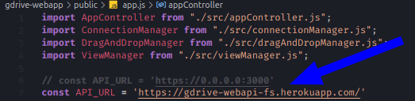
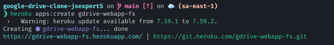
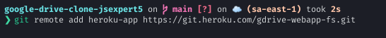

# Semana JS Expert 5.0 - Clone do google Drive

- Drag 'n drop de arquivos pra upload
- Upload sob demanda de multiplos arquivos com Nodejs Streams
- Code coverage de 100% no Backend
- Barra de progresso do upload com Websocket

## Como usar

### Dev

1. cd gdrive-webapp && npm run dev
1. cd gdrive-webapi && npm start

### Heroku (Prod)

1. no `gdrive-app/public/app.js`, coloque a url referente a sua aplicacao do heroku
   
   

1. crie uma conta no heroku
   1. instale o CLI (`sudo snap install heroku --classic`)
   1. faça o login (`heroku login`)
1. crie uma instancia no heroku: `heroku apps:create gdrive-webapp`
   
   

   **Repita o passo para o gdrive-webapi**

1. crie um remote do heroku no git: `git remote add heroku-app https://git.heroku.com/gdrive-webapp.git`
   
   
   
   **Repita o passo para o gdrive-webapi**
   
1. faça um push pro heroku: `git subtree push --prefix=gdrive-webapp heroku-app main` (ou `git push heroku-app main` caso haja um repositório pra cada aplicação)

   **Repita o passo para o gdrive-webapi**

## Outros comandos

- `heroku apps`
- `heroku logs -t`
- `heroku ps:exec --remote heroku-api`
- `heroku run "df -h" --size=free --remote heroku-api`
- `heroku apps:destroy heroku-api`